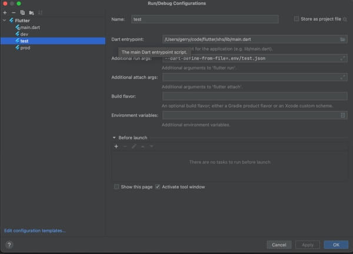
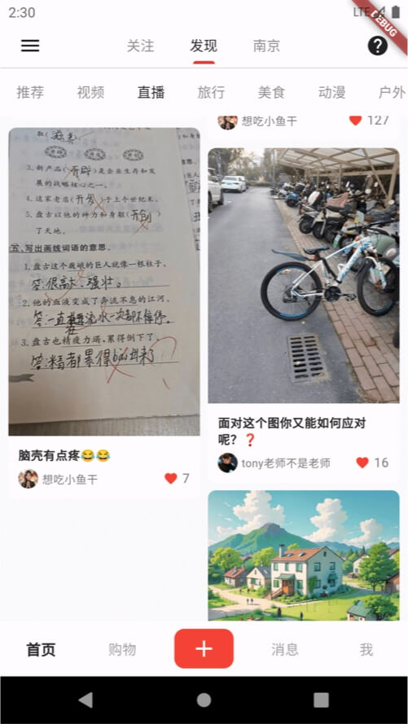

# Flutter入门学习
 小黄书，仿小红书~~~
 
# 个人介绍
* `iOS`资深菜鸟
* 精通`Android`的路上
* `Java`熟练CRUD操作
* `uniapp`精通CMD + C和CMD + V
* 精通`React Native`，可独立搭建框架调用原生方法输出Hello World


# 小黄书项目介绍
* 数据后台拉取，自建的后台服务器;
* 和小程序`五度社区`使用的同样的接口;


# SDK Version
```shell
[✓] Flutter (Channel stable, 3.10.5, on macOS 14.5 23F79 darwin-arm64, locale zh-Hans-CN)
[✓] Android toolchain - develop for Android devices (Android SDK version 34.0.0)
[✓] Xcode - develop for iOS and macOS (Xcode 15.4)
[✓] Chrome - develop for the web
[✓] Android Studio (version 2022.2)
[✓] IntelliJ IDEA Ultimate Edition (version 2022.1.3)
[✓] VS Code (version 1.91.1)
```

# 运行环境配置
* 测试 `test.json`
* 开发 `dev.json`
* 生产 `prod.json`



# 欢迎加我一起学习讨论，注明：flutter学习
  


## 页面截图



## 问题
* AppBar标题和左边按钮，有间隔？
* 嵌套scrollview，当滚动到最后一个再滑动时，事件传递给父scrollview？

## 感谢Flutter开源项目(排名不分先后)
* [仿小红书](https://github.com/MrNocLb/flutter_RedBook)
* [仿小红书](https://github.com/huang-weilong/flutter_xhs)
* [仿豆瓣](https://github.com/kaina404/FlutterDouBan)
* [仿微博](https://github.com/huangruiLearn/flutter_hrlweibo)


